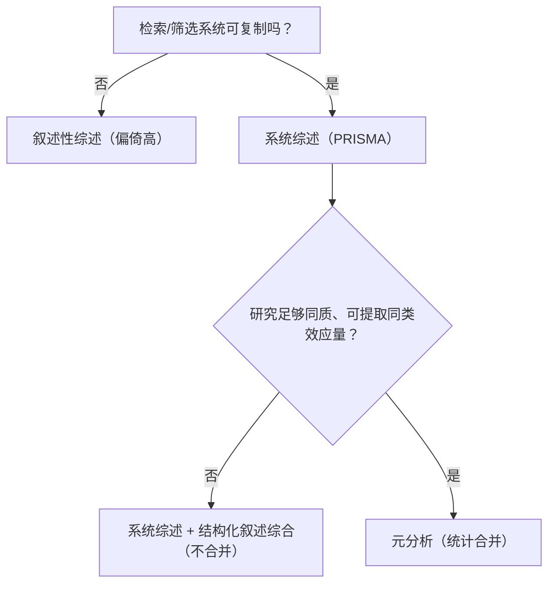
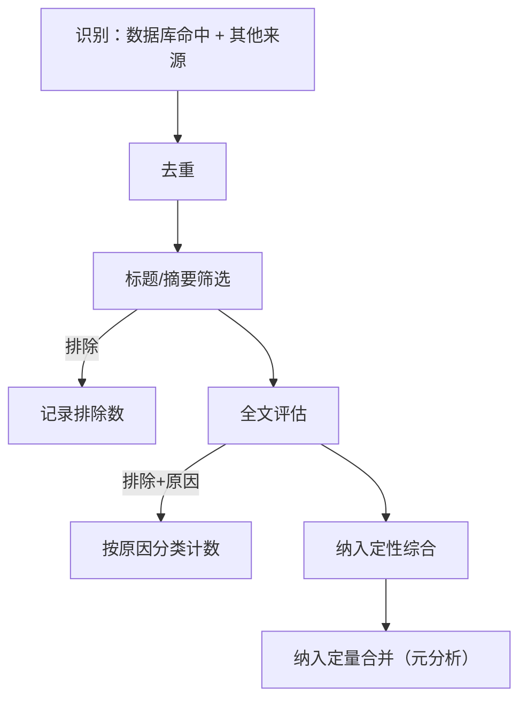
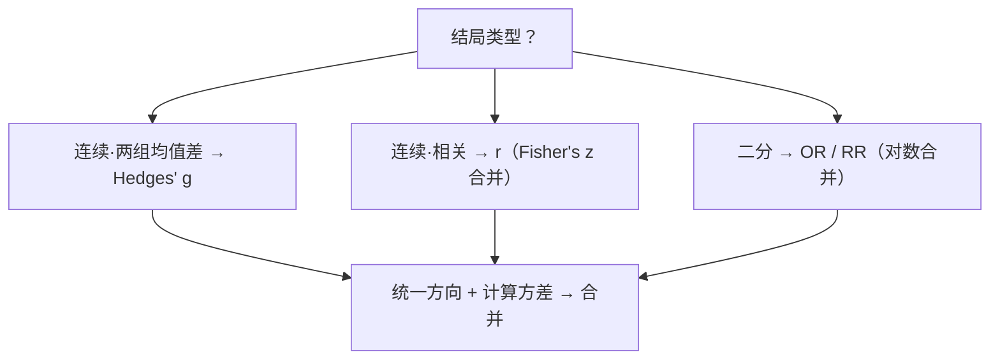
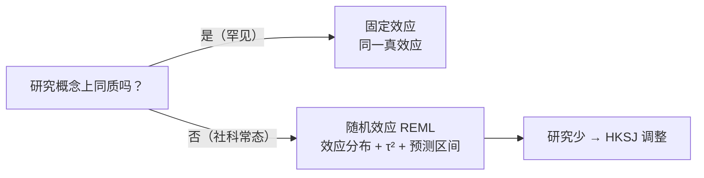
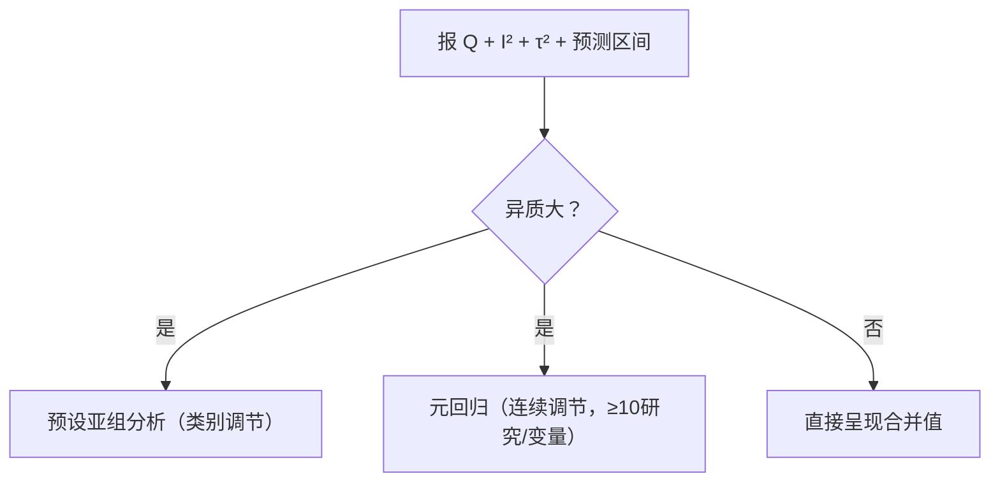
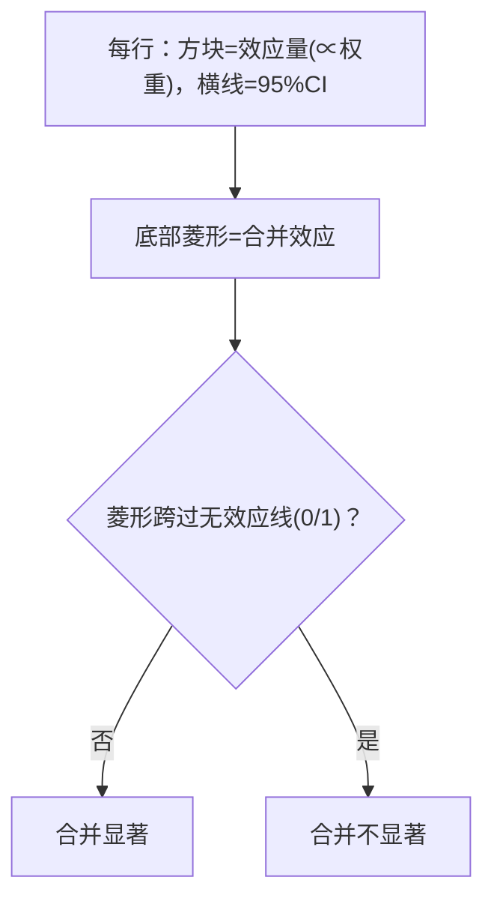

# 元分析 / 系统综述可视化（Mermaid）

> GitHub 直接渲染，可截图用于论文/科普。把示例数字替换成你自己的。

## 1 · 综述类型决策

```mermaid
flowchart TD
    A["检索/筛选系统可复制吗？"] -->|否| N["叙述性综述（偏倚高）"]
    A -->|是| B["系统综述（PRISMA）"]
    B --> C{"研究足够同质、可提取同类效应量？"}
    C -->|否| D["系统综述 + 结构化叙述综合（不合并）"]
    C -->|是| E["元分析（统计合并）"]
```

## 2 · PRISMA 2020 流程

```mermaid
flowchart TD
    A["识别：数据库命中 + 其他来源"] --> B["去重"]
    B --> C["标题/摘要筛选"]
    C -->|排除| C1["记录排除数"]
    C --> D["全文评估"]
    D -->|排除+原因| D1["按原因分类计数"]
    D --> E["纳入定性综合"]
    E --> F["纳入定量合并（元分析）"]
```

## 3 · 效应量选择

```mermaid
flowchart TD
    A["结局类型？"] --> B["连续·两组均值差 → Hedges' g"]
    A --> C["连续·相关 → r（Fisher's z 合并）"]
    A --> D["二分 → OR / RR（对数合并）"]
    B --> Z["统一方向 + 计算方差 → 合并"]
    C --> Z
    D --> Z
```

## 4 · 固定 vs 随机效应

```mermaid
flowchart LR
    A["研究概念上同质吗？"] -->|"是（罕见）"| F["固定效应<br/>同一真效应"]
    A -->|"否（社科常态）"| R["随机效应 REML<br/>效应分布 + τ² + 预测区间"]
    R --> HK["研究少 → HKSJ 调整"]
```

## 5 · 异质性处理

```mermaid
flowchart TD
    A["报 Q + I² + τ² + 预测区间"] --> B{"异质大？"}
    B -->|是| C["预设亚组分析（类别调节）"]
    B -->|是| D["元回归（连续调节，≥10研究/变量）"]
    B -->|否| E["直接呈现合并值"]
```

## 6 · 发表偏倚

```mermaid
flowchart LR
    A["漏斗图（对称？）"] --> B["Egger 检验（≥10研究）"]
    B --> C["trim-and-fill / p-curve / PET-PEESE 敏感性"]
    C --> D["结论校正后是否稳健"]
```

## 7 · 森林图解读

```mermaid
flowchart TD
    A["每行：方块=效应量(∝权重)，横线=95%CI"] --> B["底部菱形=合并效应"]
    B --> C{"菱形跨过无效应线(0/1)？"}
    C -->|否| D["合并显著"]
    C -->|是| E["合并不显著"]
```
