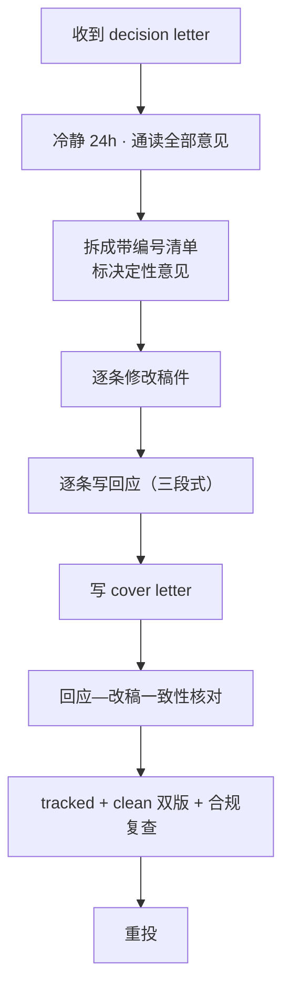
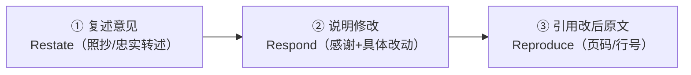
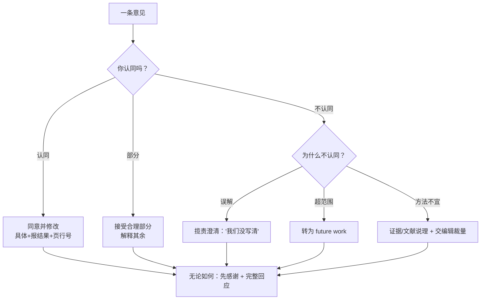
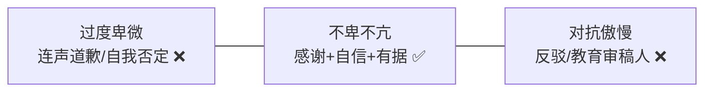
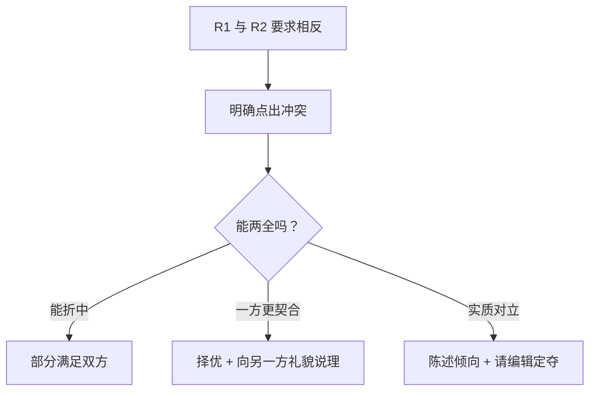

# 审稿回应可视化（Mermaid）

> GitHub 直接渲染，可截图用于科普/教学。

## 1 · 从决定信到重投的全流程

```mermaid
flowchart TD
    A["收到 decision letter"] --> B["冷静 24h · 通读全部意见"]
    B --> C["拆成带编号清单<br/>标决定性意见"]
    C --> D["逐条修改稿件"]
    D --> E["逐条写回应（三段式）"]
    E --> F["写 cover letter"]
    F --> G["回应—改稿一致性核对"]
    G --> H["tracked + clean 双版 + 合规复查"]
    H --> I["重投"]
```

## 2 · 逐条回应黄金三段式

```mermaid
flowchart LR
    A["① 复述意见<br/>Restate（照抄/忠实转述）"] --> B["② 说明修改<br/>Respond（感谢+具体改动）"]
    B --> C["③ 引用改后原文<br/>Reproduce（页码/行号）"]
```

## 3 · 每条意见的决策分支

```mermaid
flowchart TD
    A["一条意见"] --> Q{"你认同吗？"}
    Q -->|"认同"| R1["同意并修改<br/>具体+报结果+页行号"]
    Q -->|"部分"| R2["接受合理部分<br/>解释其余"]
    Q -->|"不认同"| R3{"为什么不认同？"}
    R3 -->|"误解"| M1["揽责澄清：'我们没写清'"]
    R3 -->|"超范围"| M2["转为 future work"]
    R3 -->|"方法不宜"| M3["证据/文献说理 + 交编辑裁量"]
    R1 --> Z["无论如何：先感谢 + 完整回应"]
    R2 --> Z
    M1 --> Z
    M2 --> Z
    M3 --> Z
```

## 4 · 语气光谱（找中间地带）

```mermaid
flowchart LR
    A["过度卑微<br/>连声道歉/自我否定 ❌"] --- B["不卑不亢<br/>感谢+自信+有据 ✅"] --- C["对抗傲慢<br/>反驳/教育审稿人 ❌"]
```

## 5 · 冲突审稿人的处理

```mermaid
flowchart TD
    A["R1 与 R2 要求相反"] --> B["明确点出冲突"]
    B --> C{"能两全吗？"}
    C -->|"能折中"| D["部分满足双方"]
    C -->|"一方更契合"| E["择优 + 向另一方礼貌说理"]
    C -->|"实质对立"| F["陈述倾向 + 请编辑定夺"]
```
